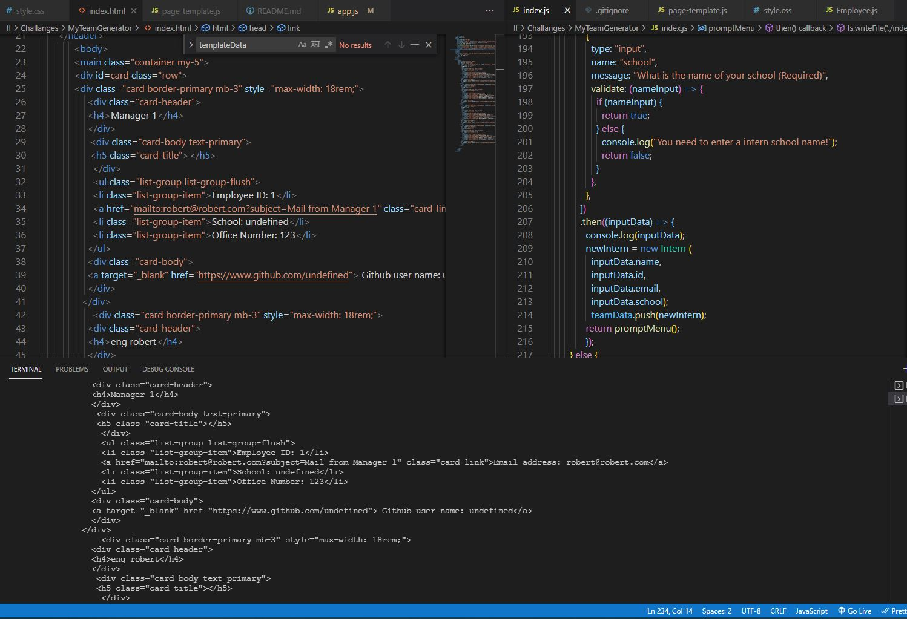

# MyTeamGenerator
  My Team Generator
  ## Badge 
 
  ## Description 
 For week 10, challenge is to build a Node.js command-line application that takes in information about employees on a software engineering team and generates an HTML webpage that displays summaries for each person.
  ## Table of Contents
  *  [Installation](#installation)
  *  [Usage](#usage)
  *  [Credits](#credits)
  * [License](#license)
  ## Installation 
 Create a .gitignore file, that include node_modules and .DS_Store/
  ## Usage 
 run "npm init" to setup your JSON file, run "npm install inquirer" to install npm dependencies
  ## Credits 
 Robert Fuke
  ## License 
  https://choosealicense.com/licenses/apache-2.0/
  ## Contribution 
 add someone
  ## Test 
 type in terminal "node index.js"
  ## Questions
  ### GitHub 
 link to my GitHub profile 
 https://github.com/LakiCode
  ### Contact 
 For any additional questions, please contact me over a Email. 
 My email address is: 
 rfuke@loffacorp.com
## App screenshots

### Video Link 
<a href="https://drive.google.com/file/d/1Y1UqZ5CJ7uxy2q4yV0JV4eUVGkkqFvv6/view" target="_blank">My Team Generator Video</a>
